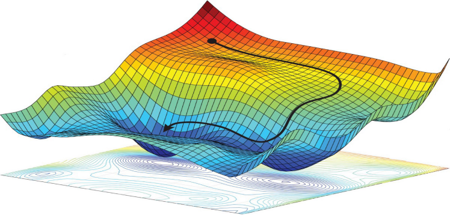

  

# Shared Computer Science and Data Science Knowledge Base

This repository is a continuously growing collection of notes, explanations, code snippets, and reference material gathered throughout academic studies and professional work in computer science, data science, and machine learning.

Unlike course-specific repositories, this project is intentionally unstructured and evolving. The goal is to serve as a shared knowledge base that can be extended, corrected, and improved collaboratively.

## Purpose

The main objectives of this repository are:

- Centralize technical knowledge collected over time
- Provide concise explanations of core concepts
- Serve as a practical reference for interviews, revision, and applied work
- Allow multiple contributors to add, refine, and update content

This repository is open to collaboration and does not follow a strict curriculum or ordering.

## Repository Structure

The repository is organized loosely by topic rather than by course or semester.

### Computer Science

Contains material related to core computer science topics, including:

- Algorithms and data structures
- Object-oriented design and methods
- Operating systems and parallel computing
- Software development, requirements, and security
- Networking, hardware, Linux, SQL, and UI design

### Machine Learning

Contains theoretical and practical material related to machine learning and artificial intelligence, including:

- Core ML concepts and terminology
- Optimization methods, loss functions, and learning rates
- Neural networks, CNNs, transformers, and autoencoders
- Supervised, unsupervised, and reinforcement learning
- Model evaluation, debugging, and diagnostics
- Code examples and experimental scripts

### Mathematics

Contains mathematical foundations relevant to data science and machine learning, including:

- Probability theory
- Statistics and time series concepts
- Linear algebra and calculus
- Convexity, optimization, and notation references

### Interviews

Contains preparation material for technical interviews, including:

- Theory summaries
- Practice questions
- Concept refreshers

## Contribution Guidelines

This repository is designed to be collaborative.

Contributions are welcome in the form of:

- New notes or explanations
- Corrections or clarifications
- Additional examples or code
- Reorganization where it improves clarity

There is no strict format requirement. Clarity and correctness are preferred over polish.

## DISCLAIMER

This repository is intended for educational and reference purposes only.

The content reflects personal understanding and collected knowledge and may evolve over time. No guarantees are made regarding completeness or correctness.

## LICENSE

Unless otherwise stated, this repository is shared for learning, reference, and collaboration. No warranty is provided.

## Author and Contributors

Initiated and maintained by  
Anton Zaitsev

Contributions from others are welcome.
