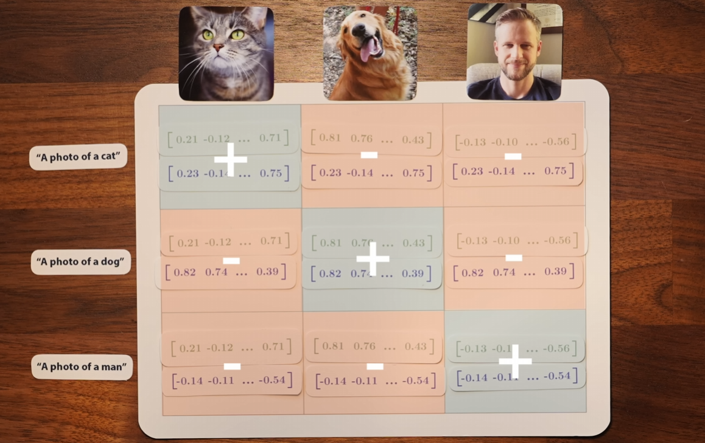
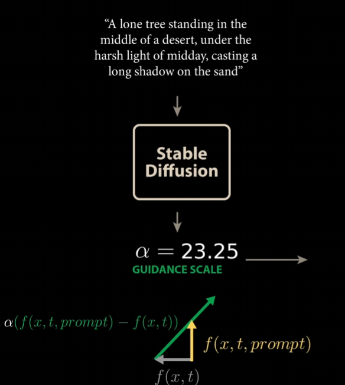
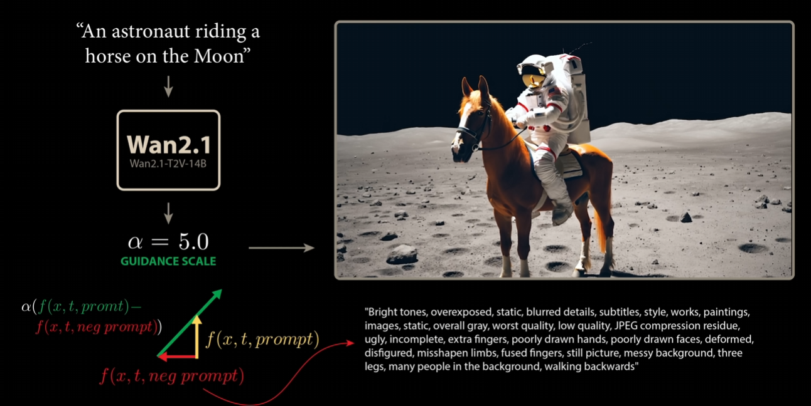

# Diffusion

## CLIP

CLIP is a model that jointly trains an image encoder and a text encoder to map images and texts into the same embedding space.  
The training objective maximizes cosine similarity between matching image–text pairs and minimizes cosine similarity between mismatched pairs.

As a result:

- an image of a cat and the text "a cat" have similar embeddings
- an image of a dog and the text "a cat" have dissimilar embeddings

These **text embeddings** are later used to **condition** diffusion models.

## Training

## Training

Diffusion models are trained to predict the noise that was added at a randomly sampled timestep $t$, not to predict the latent at timestep $t−1$.

- During training, a timestep $t$ is sampled uniformly (or from a schedule)
- Noise $\epsilon$ is added to the clean latent $x_0$ to obtain $x_t$
- The model receives $(x_t, t, c)$
- The model predicts $\epsilon$, i.e. the noise that was added to go from $x_0$ to $x_t$

The target is the original noise $\epsilon$, not $x_0$ and not $x_{t−1}$.

Forward diffusion (noising) equation (known, fixed) defines how clean data is progressively corrupted with Gaussian noise during training:

$$
x_t = \sqrt(\overline{\alpha}_t)x_0 + \sqrt(1-\overline{\alpha}_t)\epsilon, \epsilon ~ N(0, I)
$$

- $x_0$: clean image / latent ($t=0$)
- $x_t$: noisy version at timestamp $t$
- $\epsilon$: random normal noise
- $\overline{\alpha}_t$: how much signal remains after $t$ noising steps:

$$
\alpha_t = 1 - \beta_t
$$

- $\beta_t$ is a small variance added at step $t$
- also called noise schedule, manually defined at timestamp $t$
- $0 < \beta_t < 1$
- E.g. $\beta_t = \text{linspace}(\beta_{start}, \beta_{end})$, with $\beta_{start} = 10^{-4}, \beta_{end}=0.02$
- I.e. noise increases linearly over time

$$
\overline{\alpha}_t=\prod^t_{i=1}\alpha_i
$$

- small $t -> \overline{\alpha}_t \approx 1 ->$ mostly signal
- large $t -> \overline{\alpha}_t \approx 0 ->$ mostly noise

Objective:

$$
\min_\theta E_{x_0, \epsilon, t}\left[||\epsilon - \epsilon_\theta(x_t, t, c)||^2\right]
$$

- $t$ is sampled randomly each training step
- The model sees all timesteps across training
- It learns a single noise-prediction function valid for any $t$

To enable classifier-free guidance, the model is also trained on unconditional inputs:

$$
\min_\theta E_{x_0, \epsilon, t}\left[||\epsilon - \epsilon_\theta(x_t, t, \emptyset)||^2\right]
$$

This is implemented by:

- randomly dropping the text condition with probability p (typically 5–20%)
- using an empty or null text embedding when dropped

Important:

- no guidance scaling $\alpha$ or subtraction happens during training
- the model only learns conditional and unconditional denoising

## Inference

At inference time, classifier-free guidance is applied by combining unconditional and conditional predictions:

$$
\epsilon = \epsilon_{\text{uncond}} + s \cdot (\epsilon_{\text{cond}} - \epsilon_{\text{uncond}})
$$

where:

- $s$ is the guidance scale
- larger $s$ enforces stronger adherence to the prompt
- smaller $s$ produces more diverse but less prompt-aligned samples

## Classifier-Free Guidance (CFG)

Geometrically, CFG can be interpreted as moving in latent space from the general data distribution toward a conditional distribution.

$$
\alpha \cdot (f(x,t,\text{cat with green eyes}) - f(x,t))
$$

- $\alpha$ is the guidance scale
- $f(x,t)$ points toward the unconditional (general) distribution
- $f(x,t,\text{cat with green eyes})$ points toward the conditional distribution for the prompt "cat with green eyes"

As $\alpha$ increases, the model generates samples more strongly aligned with the prompt, at the cost of diversity.

### Negative Prompt

Negative prompting is an inference-time extension of CFG.

Instead of using only an unconditional prediction, we introduce an additional conditional prediction based on a negative prompt that describes features we want to avoid.

The combined guidance becomes:

$$
\epsilon = \epsilon_{\text{uncond}}
+ s_{pos} \cdot (\epsilon_{\text{pos}} - \epsilon_{\text{uncond}})
- s_{neg} \cdot (\epsilon_{\text{neg}} - \epsilon_{\text{uncond}})
$$

Where:

- $\epsilon_{\text{pos}}$ is conditioned on the positive prompt
- $\epsilon_{\text{neg}}$ is conditioned on the negative prompt

This steers the generation:

- toward desired concepts
- away from unwanted concepts

Negative prompting is:

- not learned explicitly during training
- purely an inference-time guidance mechanism

