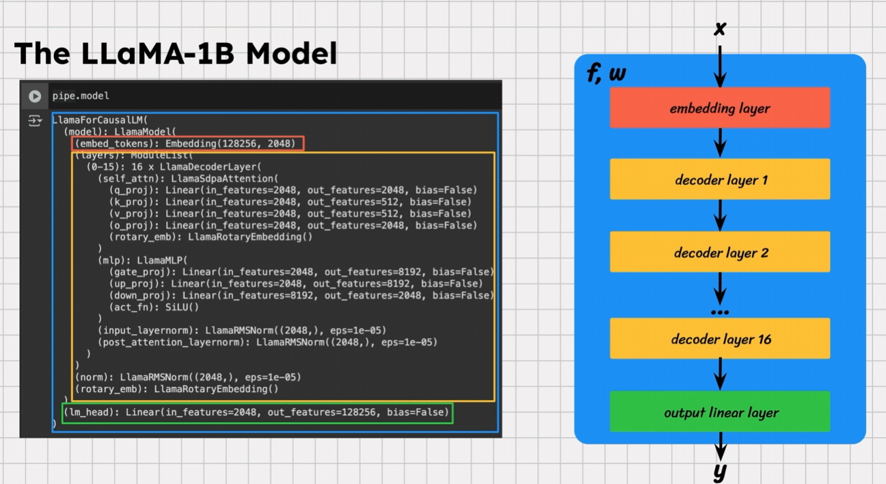
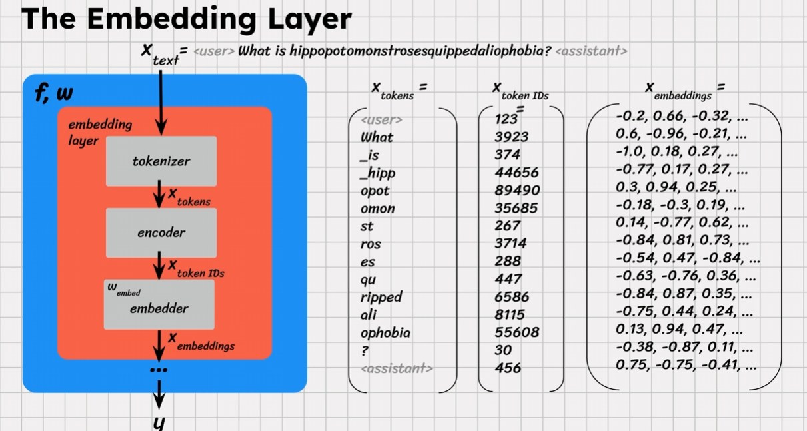

## Embedder

Embeddings have geometrical properties where similar words, like king and queen, lie close to each other in the vector space. Embeddings then passed to the rest of the network.

### Logits Processor

Using logits processor, we can manipulate the probabilities of individual tokens seen in the output. Remember that LLMs output probability distribution, from which words are then sampled. E.g., we can set the probability of tokens containing letter "e" to $-\text{inf}$ to get text without words containing letter "e".
